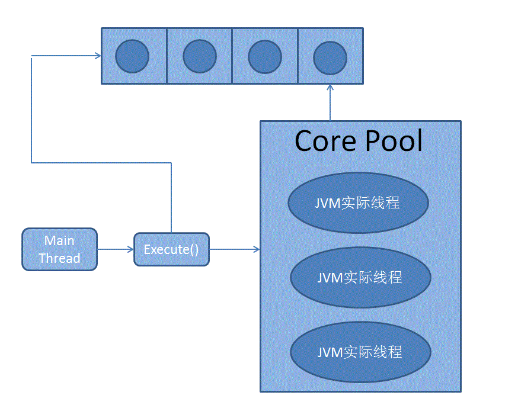

# Guava 并发 - ListenableFuture 

## 前言

之前使用 jdk Future & Callback，代码一般如下

```
    ExecutorService single=Executors.newSingleThreadExecutor();
    Future<String> f= single.submit(() -> { ** });
    f.get()
```



这个时候 主线程也会卡住。
所以，一般要自己实现的话，要起另外一个线程去check，是否完成。
guava相当于把这一步帮我们做掉了。


## ListenableFuture的使用

#### 1. addCallback 

这个是LisenableFuture的基本使用
异步处理 线程的结果回调

```
    ListeningExecutorService service = MoreExecutors.listeningDecorator(Executors.newFixedThreadPool(10));
    ListenableFuture<String> future = service.submit(() -> {
            ***
    });
    Futures.addCallback(future, new FutureCallback<String>() {
        @Override
        public void onSuccess(String result) {
            ***
        }

        @Override
        public void onFailure(Throwable t) {
            ***
        }
    }, Executors.newFixedThreadPool(10)); 
    // 这里如果不设置 ，就会用主线程执行，会阻塞
```

## ListenableFuture 源码分析
主要就是看下
为一个future 添加一个 callback，然后怎么回调这个callback的
```
Futures.addCallback(ListenableFuture<V> future, FutureCallback<? super V> callback, Executor executor){
    Preconditions.checkNotNull(callback);
    Runnable callbackListener =
        new Runnable() {
          @Override
          public void run() {
            final V value;
            try {
              value = getDone(future);
            } catch (ExecutionException e) {
              callback.onFailure(e.getCause());
              return;
            } catch (RuntimeException e) {
              callback.onFailure(e);
              return;
            } catch (Error e) {
              callback.onFailure(e);
              return;
            }
            callback.onSuccess(value);
          }
        };
    future.addListener(callbackListener, executor);
  }
```

可以看到定义了一个Rnnable去做回调。然后addListener这个方法  
会走到 future.addListener(callbackListener, executor);  
如果这个线程没有执行完, 挂到listeners上 （一个Listener的队列）  
```
@Override
  public void addListener(Runnable listener, Executor executor) {
    checkNotNull(listener, "Runnable was null.");
    checkNotNull(executor, "Executor was null.");
    Listener oldHead = listeners;
    if (oldHead != Listener.TOMBSTONE) {
      Listener newNode = new Listener(listener, executor);
      do {
        newNode.next = oldHead;
        if (ATOMIC_HELPER.casListeners(this, oldHead, newNode)) {
          return;
        }
        oldHead = listeners; // re-read
      } while (oldHead != Listener.TOMBSTONE);
    }
    // If we get here then the Listener TOMBSTONE was set, which means the future is done, call
    // the listener.
    executeListener(listener, executor);
}
```

执行的线程最后包装成了一个TrustedFutureInterruptibleTask, 流程如下:
1. 把value设置成结果, 然后调用complete
2. 会先释放future的所有的waiters(直接执行Future.get的)
3. 把挂在listener上的所有task都执行一遍

```
TrustedFutureInterruptibleTask
@Override
void runInterruptibly() {
    // Ensure we haven't been cancelled or already run.
    if (!isDone()) {
    try {
        set(callable.call());
    } catch (Throwable t) {
        setException(t);
    }
    }
}

AbstractFuture:
protected boolean set(@Nullable V value) {
    Object valueToSet = value == null ? NULL : value;
    if (ATOMIC_HELPER.casValue(this, null, valueToSet)) {
      complete(this);
      return true;
    }
    return false;
}

private static void complete(AbstractFuture<?> future) {
    Listener next = null;
    outer: while (true) {
      future.releaseWaiters(); // 释放所有等待线程
      future.afterDone();
      // push the current set of listeners onto next
      // 这里会把头节点换成 一个指定线程TOMBSTONE
      // 然后把所有的线程逆序排列出来， 因为加入的时候，是每次插入到最前面
      next = future.clearListeners(next);
      future = null;
      while (next != null) {
        Listener curr = next;
        next = next.next;
        Runnable task = curr.task;
        if (task instanceof AbstractFuture.SetFuture) {
          AbstractFuture.SetFuture<?> setFuture = (AbstractFuture.SetFuture) task;
          future = setFuture.owner;
          if (future.value == setFuture) {
            Object valueToSet = getFutureValue(setFuture.future);
            if (ATOMIC_HELPER.casValue(future, setFuture, valueToSet)) {
              continue outer;
            }
          }
        } else {
          executeListener(task, curr.executor);
        }
      }
      break;
    }
  }
```

线程安全：

1. addListener的时候，可能发现oldHead还不是墓碑（没执行完）， 这里会尝试把自己换成头节点，替换成功说明成功加入list
2. set完成的时候，会把头节点换成 墓碑，然后再执行整个list

所以不存在add后，但是没有执行的情况
