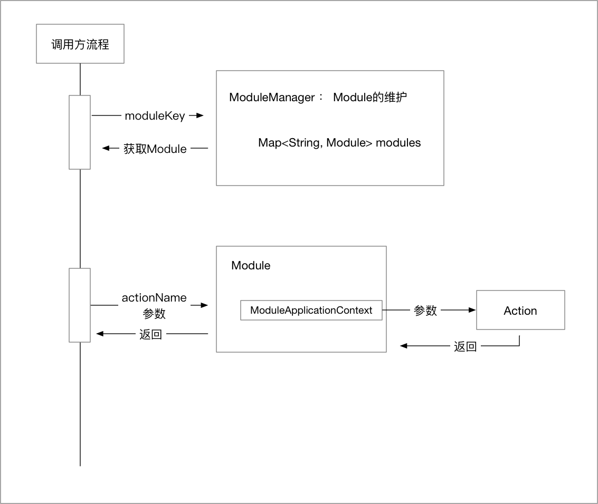
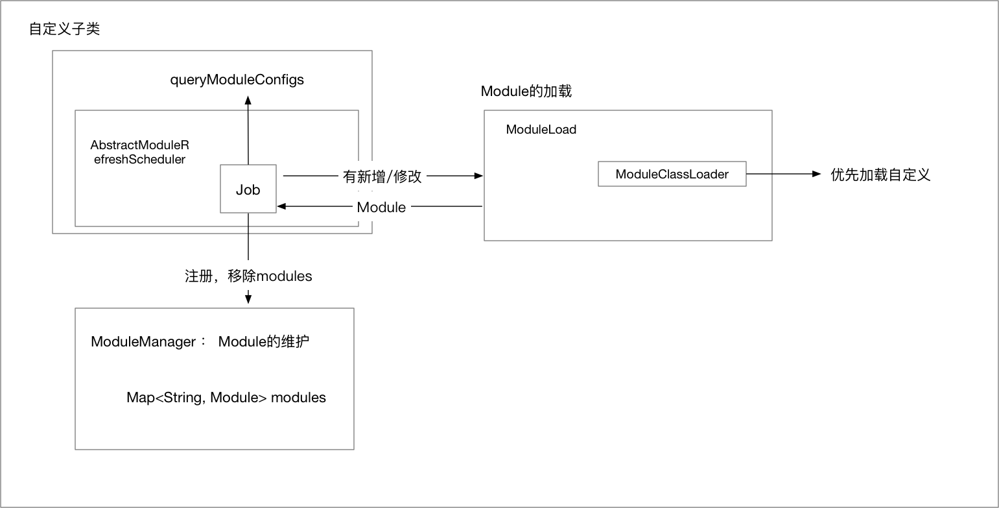
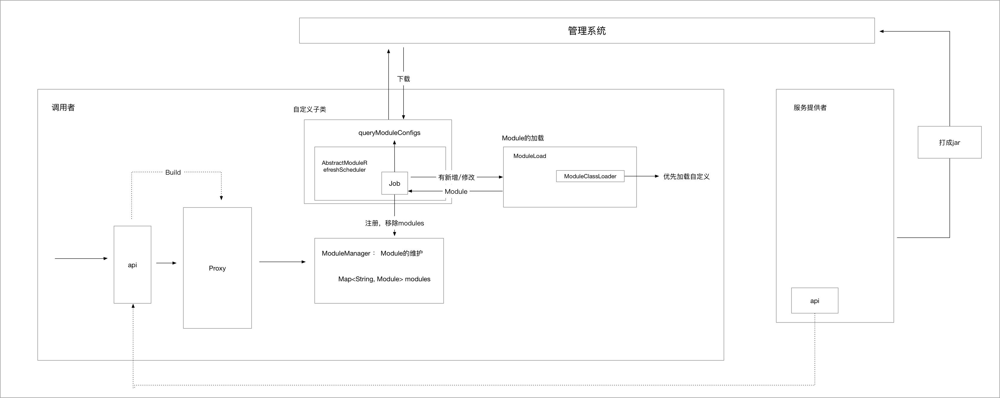

## 简介
基于JAVA的模块化开发框架, 它提供在运行时动态加载模块、卸载模块和模块间调用的API。

## [需求 & 应用场景](https://github.com/alibaba/jarslink/wiki/index-cn)

## 使用

- Module (调用者使用)  
    每一个隔离模块
- Action (提供者实现)  
    模块中的Service

就是BeanFactory 和 bean的关系

#### ModuleRefreshSchedulerImpl
注册管理
``` java
public static final String JARSLINK_MODULE_DEMO_V1 = "jarslink-module-demo.jar";
public static final String JARSLINK_MODULE_DEMO = "jarslink-module-demo-1.0.0.jar";

 public static ModuleConfig buildModuleConfig() {
    ModuleConfig moduleConfig = new ModuleConfig();
    moduleConfig.setName("demo");
    moduleConfig.setEnabled(true);
    moduleConfig.setProperties(ImmutableMap.of("svnPath", new Object()));

    boolean v1 = getV1Jar();
    if (v1) {
        moduleConfig.setVersion("1.0.0.20170621");
        URL demoModule = Thread.currentThread().getContextClassLoader().getResource(JARSLINK_MODULE_DEMO_V1);
        moduleConfig.setModuleUrl(ImmutableList.of(demoModule));
        return moduleConfig;
    } else {
        moduleConfig.setVersion("1.0.0.20180618");
        URL demoModule = Thread.currentThread().getContextClassLoader().getResource(JARSLINK_MODULE_DEMO);
        moduleConfig.setModuleUrl(ImmutableList.of(demoModule));
        return moduleConfig;
    }
}
```

#### TestService
``` java
 public static void main(String[] args) {
        ApplicationContext applicationContext = new ClassPathXmlApplicationContext("config.xml");
        ModuleManager moduleManager = (ModuleManager) applicationContext.getBean("moduleManager");

        while (true) {
            //查找模块
            Module findModule = moduleManager.find("demo");
            String actionName = "overrideTestBeanAction";
            String result = findModule.doAction(actionName, "aaa");
            System.out.println(result);

            try {
                Thread.sleep(1000);
            } catch (InterruptedException e) {
                e.printStackTrace();
            }
        }

    }
```


## 原理分析

### 调用方流程



### 刷新流程

- AbstractModuleRefreshScheduler: 定时刷新模块的抽象类 
- ModuleLoader：模块加载引擎，负责模块加载
- ModuleManager：模块管理者，负责在运行时注册，卸载，查找模块和执行Action
- ModuleClassLoader: 自定义的ClassLoader，不使用双亲委派模型




## 思考

#### 使用场景
- 中间件动态替换
    - redis
    - kafka
    - memcahce
    - ...

#### 展望

- 客户端提供jar包，服务端build代理类调用
    - 原因
        - 目前需要客户端使用moduleName，actionname来调用
        - 看不到module的提供的action的参数 & 返回  
    - 实现方式：
        - 使用builder代理类来实现，使用module及参数传递过程
- 管理系统来自动化部署流程


