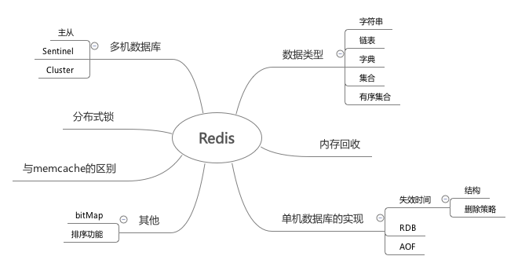

# 一个简单的Redis学习总结

最近把redis设计与实现看了一下，挑着里面感兴趣的点看了下，补充了一些之前看博客没了解的知识点。 总结一下

### Redis常用的数据类型

- SDS 简单动态字符串

    相当于在C字符串的基础上进行了一次封装  
    存储了字符串的长度，而且会预先分配空间，当修改是不需要再次分配内存

- 链表

    就是一个双向链表，维护列表的长度

- 字典

    类似于 HashMap  
    在rehash的时候做了优化，会渐进hash，维护上次hash进度的offset。所以需要维护两个hash表，其中一个只在rehash的时候使用

- zset

    使用的数据结构是跳表  
    并且会维护跳表的路径长度，这样支持zset里的offset操作
    并且维护后退指针，可以反向查找

- 整数集合 & 压缩表
    
    当set，zset或者list 很小点情况，会使用这种数据结构来保存

#### 内存回收

    redis内存回收使用的是引用计数来进行释放

### 单机数据库的实现

#### 失效时间

- 实现

    通过存一张单独的有效截止时间hashmap来实现

- 删除策略

    1. 惰性删除  操作key前后check失效时间
    2. 定时删除  再每次运行的时候，取一定数量的随机键进行检查，删除其中过期建

- 在主从复制中

    从节点里，不会去删除过期键，只有主节点删除过期键，从节点才会删除过期键

#### RDB

- Save 阻塞用户线程执行保存操作  
- BgSave fork一个进程来来保存

    这里本来很疑惑bgsave线程不会和用户线程产生并发问题吗，后来了解是fork了一个进程。子进程和父进程是相互隔离的，copy on write的关系

#### AOF

- 记录文件记录
- AOF文件重写

    1. 重写是基于当前内存，不基于之前的aof文件
    2. 重写时的命令会计入aof重写缓存区

### 多机数据库

#### 主从复制

- 全部复制（旧版）

    每次开始连接，或者断开一会之后的重连，都会全部复制  
    主执行bgsave，生产rdb文件，并在缓存区记录后续的操作。  
    然后将rdb文件发给从，进行执行。之后再继续发送后续的操作  

- 部分同步 （新版）

    主会维护一定数量的命令的缓存池
    主从都会维护一个偏移量。
    当短线重连后，会对比这个偏移量来判断需要发送的命令。（如果已经不在缓存池里，则执行全部复制）

#### sentinel

- sentinel每隔一段时间会向master发info命令
- sentinel 发现新的节点后，会建立连接，并每隔一段时间info
- 当sentinel 判定一个master下线后，会想起他sentinel询问。收集到足够多下线投票后，会将主服务器判断为下线，然后执行一次故障转移
- 故障转移
    1. 选出新的主服务器
    2. 修改从服务器的复制目标
    3. 将旧的服务器变成从服务器

#### cluster

- 节点 发送命令，通过握手将其他节点拉近自己的集群
- 通过槽派指（16384个槽）保存数据库中的键值对， 每个节点都会存这个键值对
- 客户端调用如果不是对应节点，会返回move命令 和对应节点
- 支持重新分片， 分片时，会自动将源节点的数据迁移到新的节点上
- 支持复制和故障转移，可以给cluster节点配置从节点，

### 分布式锁

一般是通过setnx来实现，非空才能set成功，保证只有一个客户端能够成功

但是这里有一个要使这个锁失效的问题，防止持有锁的线程挂了来不及释放。
1. 可以把setnx和expire放到lua脚本里来执行，包装setnx成功后，expire一定执行成功
2. 可以在超过时间后，用的getset来抢锁，getset会返回覆盖的值，覆盖第一个值的客户端抢到锁

### 与memcache不同

1. 单线程
2. 数据结构丰富
3. 可持久化
4. redis自己实现了一个轻量级的epoll nio连接库，性能也不错

### BitMap

通过SDS实现
